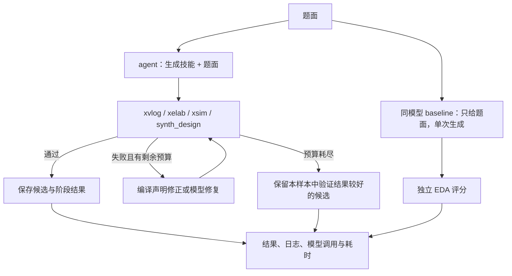

# 156 题复盘与 RTL 技能优化

最新更新：2026-09-20，见末尾“修复反馈与退步回退”。此前深度分析描述修复前快照，其代码行号亦对应修改前；问题处理状态以末尾为准。2026-09-13 各节为队友 E 盘机器的历史实验记录；本机 D 盘仅持有其中的精简报告，不代表新版、隐藏集或 ROCm 性能。

## 已核对的原始成绩

来源：`04_project/amd_rtl_agent/outputs/full156_20260913_111459` 的 156 份单题结果；原始结果不改写。
可复现汇总：`04_project/amd_rtl_agent/bench/results/full156_failure_analysis_20260913.json`。

| 指标 | 数量 |
|---|---:|
| baseline 通过 | 101/156（64.74%） |
| agent 首次生成通过 | 94/156（60.26%） |
| agent 最多一次修复后通过 | 110/156（70.51%） |
| 实际修复成功 | 16/62 次修复 |
| 相对 baseline 改善 / 退化 | 17 / 8 题 |
| 修复代码与上次完全相同 | 15/62 次修复 |
| agent 最终失败阶段 | 格式 4、编译 6、展开 1、仿真 35 |

最终净增 9 题、5.77 个百分点。首次生成低于 baseline，不能把最终增益全部归于技能提示。
本次每题只有一个 agent 样本，不报告 pass@5。35 道仿真失败只证明功能不符，尚未逐题确认所有根因。

## 从失败中提炼的 skill

短生成规则位于 `04_project/amd_rtl_agent/skill/RTL_SKILL.md`，每次 agent 生成加载；
修复规则位于同目录 `RTL_REPAIR_SKILL.md`，仅修复时追加。baseline 仍只收到题目原文。

| 可复用技能 | 触发或观察证据 | 实际指导 |
|---|---|---|
| 声明与作用域 | Prob039、Prob058 报过程赋值目标为非变量；Prob108 在过程块内声明 wire | always 目标用 reg/logic；连线与 assign 放模块作用域 |
| 紧凑完整生成 | Prob030 逐位展开未写完；Prob082 长篇注释后截断 | 固定边界循环或向量表达式，省略推导，完整结束模块 |
| 逐拍时序核对 | Prob054 仿真输出不匹配 | 对照题意核对旧值、寄存输出、复位与延迟，不凭错误数猜答案 |
| 状态机与计数边界 | 多个状态机题停在仿真，具体根因仍需逐题分析 | 按状态表逐行实现，检查当前/下一状态输出、重叠检测及首末拍 |
| 基于证据修复 | 15 次原样重发；长日志丢失最早诊断 | 先修根本报错，针对反馈改变代码，禁止猜测未提供波形 |

这些是依据失败模式制定的通用规则，未读取参考实现来编写题目专用解法。规则没有题号匹配、答案表或参考代码。

## 控制逻辑修正

- 压缩日志中的绝对路径，去除重复诊断，保留最早报错及最终统计，仍限制在 4096 字符内。
- 在相同验证阶段中，按 `Mismatches: N in D samples` 的错误比例选择候选；未通过的低错误率候选仍算失败。
- 原始记录中 Prob050、Prob142、Prob155 的第二次尝试错误比例降低，却因旧排序并列而丢弃；新规则覆盖此情形。
- 生成与修复技能分别记录 SHA-256，便于追踪实验版本。
- 新增 `bench/analyze_run.py` 离线复盘入口和 `bench/retest_subset.py` 定向复测入口；复测核对题目哈希、模型配置并沿用原样本 seed，写入新目录。

## 验证方式与边界

24 项自动测试通过，覆盖原有行为、诊断截取和低错误率候选选择。
真实模型定向验证选 Prob001（已通过对照）、Prob030、Prob039、Prob054、Prob108；
沿用 Qwen3.6-27B、2048 输出预算、温度 0.2、原 seed，每题一个样本、最多一次修复，
执行 Vivado 编译、展开、仿真和综合。独立证据目录：
`04_project/amd_rtl_agent/outputs/optimization_subset_20260913`。

这是按失败类型挑选的开发样本，且对照来自历史运行，不是独立留出测试或严格随机 A/B；
不得将其通过率外推为新版完整 156 题成绩。完整集新版成绩仍需后续同配置复测。

## 定向实测结果

已完成 5/5，旧版通过 1 题，新版通过 3 题：

| 题目 | 历史结果 | 本次结果 |
|---|---|---|
| Prob001_zero | 通过 | 首次通过仿真与综合 |
| Prob030_popcount255 | 格式失败 | 首次通过仿真与综合 |
| Prob039_always_if | 编译失败 | 一次修复后仍编译失败 |
| Prob054_edgedetect | 仿真失败 | 一次修复后通过仿真与综合 |
| Prob108_rule90 | 编译失败 | 一次修复后仍编译失败 |

精简实测证据：`04_project/amd_rtl_agent/bench/results/optimization_subset_20260913.json`。
仍未解决的两题说明自然语言规则不能保证模型服从。后续优先验证更具体的声明修复指导，
并在独立样本和完整集检查回归；不将未完成的方向记为已有效优化。

## 2026-09-13 编译驱动修复与重复检测验证完成

- agent 根据 Vivado VRFC 10-1280 报错，将简单 ANSI 输出声明中的对应 output/output wire 修正为 output reg，保留位宽、符号、方向与逻辑；宏、参数化及复杂声明不自动修改。修正占已有修复次数，仍需完整 EDA 验证。
- 同一样本内按精确代码哈希检测重复，重复的格式/编译失败复用已完成诊断，下一次模型提示明确指出原样返回。超时、工具缺失和仿真不缓存。记录 source、duplicate_of_attempt、evaluation_reused、model_calls。
- 30 项自动测试通过。两道历史失败代码 Prob039、Prob058 重放均由编译失败经一次声明修正通过真实 Vivado 仿真和综合（分别 Mismatches: 0 in 114 / 219 samples）。
- 本轮使用归档候选替代模型响应，没有调用云端 API；这是修复控制逻辑验证，不是新的模型成绩，不能合并进旧 156 题通过率。模型配置未切换。
- 复现入口：04_project/amd_rtl_agent/tests/run_declaration_regression.py；精简证据：04_project/amd_rtl_agent/bench/results/declaration_regression_20260913.json。未发布。

## 2026-09-20 拉取最新版与本机分析

本次 fetch 并核对远端 refs：开发分支 `fix/reliable-evaluation` 最新为 `da2fb8e`；`main` 仍为 `d5753b4`。D 盘主目录现已切换至最新开发分支，未推送或合并 main。

### 本地改动与资料保留

- 拉取前 15 个已跟踪文件的未提交改动已完整保存在 stash `de9254643da829767e8bacb3ee57a5c633a4718f`，说明为 `pre-sync-2026-09-20-local-tracked-work`。旧 agent.py、test_agent.py 和重叠说明文档尚未合并，不能把 stash 整体直接覆盖到新版。
- 已恢复与远端无重叠的本地资料索引、来源元数据、07 分析、AI_HANDOFF 及 Git/Docker 的 .part 排除规则。未跟踪的原始 PDF/DOCX、提取文本、connect_api.ps1 与原 outputs 均保留。
- 本机 `qwen36_api_full156_20260913/benchmark.json` 实际为 finished=10、evaluated=10、complete=false；保持用户暂停状态。它采用 baseline1+agent5，不能与远端另一台机器的单样本实验合并，也没有新版续跑必需的 experiment.json。

### 本次核验结果与判断

- 在最新版原样核心代码上执行 `python -B -m unittest discover -s tests -v`：39/39 通过。本轮没有执行模型 API、Vivado 集成回归、GPU 或全量评测。
- 重算 `bench/results/qwen_cloud_full156_20260913.json` 的 156 条唯一题目记录：baseline=101、agent 最终=110、修复成功=16、相对改善=17、退化=8，汇总一致。
- `full156_failure_analysis_20260913.json` 记录首次通过94，最终失败46（格式4、编译6、展开1、仿真35）。对应完整原始输出在本机不存在；以上是仓库历史精简报告的核对，不是本机重跑验证。
- baseline 64.74%，agent 首次60.26%，最多一次修复后70.51%，净增5.77个百分点。首次少7题、最终多9题，现有结果支持修复链路有用，不能证明单靠生成提示提升。35/46 的最终失败停在仿真，后续主要工作应是定位功能语义、复位/时序和状态机错误，而非继续增加架构层。
- 新版增加修复专用提示、编译报错驱动的简单输出声明修正、重复失败复用、保留更好候选，以及带配置/文件哈希核验和目录锁的逐题检查点。五题定向历史对比为1/5到3/5，两题声明修复重放通过；均不足以给出新版全量通过率，且不构成 pass@5 或 ROCm 成绩。

### 当前可定位问题和执行顺序

1. `run_cloud_smoke.ps1:38` 与 `bench/run_full_156.py:40` 固定 E 盘 Vivado；本机 E 路径不存在，F 盘 vivado.bat 存在。这两个入口还覆盖推理服务地址，正式重跑前应允许沿用本机环境配置。
2. `bench/run_full_156.py` 自动选择最近含 progress.jsonl 的旧目录并跳过成功题，不校验整批代码、模型和技能是否一致；不同版本之间有混合统计风险。新 `agent.py benchmark --resume` 有输入指纹保护，但不会替旧启动器补上整批保护。后续优先使用新入口及独立输出目录。
3. `vivado_eval.tcl` 生成时序报告，但没有以 slack 判断失败，且只对名为 clk 的端口创建时钟。因此现有批量“通过综合”不能等同于每题都满足200 MHz时序。
4. 先处理启动路径和实验隔离，再以相同预算重测新版完整公开集，并保留退化题清单；本轮用户请求为拉取与分析，未启动长时评测。最新目录中的39项测试通过不等于上述问题已修复。
5. 官方镜像/隐藏集/最终接口发布状态本轮未外部核验；沿用项目待核验记录。ROCm仍按用户范围延后。

## 2026-09-20 深度分析：代码、证据与交付差距

**结论：项目已有可运行的 RTL 生成与修复闭环；当前最需要补强的是评测可信度、同配置全量验证和最终本地部署证据。历史 70.51% 是旧实验成绩，不能用作最新代码在 Vivado 2026.1 下的通过率。**

### 分析对象与验证边界

- 本轮 fetch 后，`fix/reliable-evaluation` 与远端同为 `da2fb8ea0890cd68012a983eefb710f4c2299e7a`，远端 `main` 为 `d5753b467c12c0a204aae37b26911035d7a983ad`；没有新提交可再拉取，未推送。
- 当前主目录为 `D:/HUST/IC/FPGA`。相对远端，四个运行文件的本地修改仅为 Vivado 默认路径切换至 `F:/vivado/2026.1/Vivado/bin`；其余未提交资料、状态文件与既有 stash 保留。上节“E 盘路径待修复”已由本日升级工作解决。
- 本次深度分析包括源码检查、精简报告重算、已有真实 EDA 日志核对和两个临时目录中的离线 mock 探针；不修改运行逻辑，没有调用模型 API、恢复暂停批次或启动新全量评测。
- 升级工作已经得到 39/39 自动测试、2026.1 真实 EDA 回归 5/5 的证据。本次分析复核这些记录；5 项中修复流程使用固定 mock 模型响应，且该项跳过综合。不能把它写成真实模型修复率。
- 本机暂停批次 `outputs/qwen36_api_full156_20260913` 仍为 10/156、`complete=false`，使用 agent 5 样本；历史完整 156 题报告来自另一批 agent 单样本实验，二者不合并。

证据入口：[2026.1 回归汇总](D:/HUST/IC/FPGA/04_project/amd_rtl_agent/outputs/vivado_2026_1_licensepath_20260920/summary.json)、[历史全量精简报告](D:/HUST/IC/FPGA/04_project/amd_rtl_agent/bench/results/qwen_cloud_full156_20260913.json)、[历史失败分析](D:/HUST/IC/FPGA/04_project/amd_rtl_agent/bench/results/full156_failure_analysis_20260913.json)。原始全量输出指向队友的 E 盘目录，本机没有该批完整日志，不能逐题重判或验证全部历史根因。

### 实际架构与已经做对的部分

核心仍是一份 `agent.py` 加一个 Tcl 脚本，直接函数调用足够承载当前规模，不需要增加智能体框架、中间服务或多模型路由。相对主分支，新版的重要改进集中在以下方面：

1. **基线与能力指标分开。** `baseline_generate()` 只发送题目、只调用一次模型；其后的 EDA 是对生成结果评分。无测试台或跳过 EDA 时，功能指标为 `null`；不足 5 样本不报告 pass@5。
2. **修复由实际反馈驱动。** 普通生成与修复技能分开；特定编译诊断可直接修正输出声明，减少一次模型调用。格式/编译阶段完全相同的失败可复用，超时和无法启动的情况不复用。
3. **保留较好的尝试。** 同一样本中依次比较通过状态、验证阶段和仿真错误比例，防止最后一次修复退步后覆盖前一次较好代码。原始响应、候选与评测记录均有保留。
4. **新 benchmark 具备可用的续跑保护。** 校验代码、技能、题面、参考和测试台哈希；整批目录有锁；每题写检查点；中断题放入新的 `restart_N` 子目录。已完成题恢复前校验文件，不静默覆盖。
5. **成本开始可解释。** 结果分别记录模型调用次数、模型耗时和 EDA 耗时；这些新增字段比单一通过率更适合判断一次修复是否值得。

这些是代码与自动测试能支持的工程改进，不直接证明模型成功率提升。相关实现：[修复循环](D:/HUST/IC/FPGA/04_project/amd_rtl_agent/agent.py:491)、[配置指纹与续跑](D:/HUST/IC/FPGA/04_project/amd_rtl_agent/agent.py:677)。

### 历史实验究竟说明什么

历史配置为云端 `qwen3.6-27b`、输出上限 2048、温度 0.2、记录的上下文配置 8192；每题 baseline 一次，agent 一个样本、最多一次修复。

| 指标 | 重算结果 | 可以支持的判断 |
|---|---:|---|
| baseline | 101/156，64.74% | 同批历史裸跑成绩 |
| agent 首次生成 | 94/156，60.26% | 首次生成较 baseline 少 7 题 |
| agent 修复后 | 110/156，70.51% | 最终净增 9 题，即 5.77 个百分点 |
| 两者均通过 / 均失败 | 93 / 38 | 不能只展示改善题而忽略未改善题 |
| agent 独有通过 / baseline 独有通过 | 17 / 8 | 有增益，也存在实际退化 |
| 修复成功 | 16/62，25.81% | 历史触发修复的失败中约四分之一被修好 |
| 原样重复修复 | 15/62，24.19% | 去重与针对反馈修改有明确历史动机 |
| 最终 46 题失败 | 格式 4、编译 6、展开 1、仿真 35 | 76.09% 停在仿真，功能正确性是主要待分析方向 |
| 单题记录耗时之和 | 13,884.799 秒，约 3.86 小时 | 不等于含重试、中断和启动等待的整批墙钟时间 |

本次逐条重算了 156 个唯一题目的 baseline、最终结果、改善/退化与耗时；首次生成、修复数和失败阶段来自仓库归档的失败分析，未在缺失的原始日志上独立重判。

首次生成少 7 题，修复增加 16 题，形成最终净增 9 题。因此当前证据更支持“修复闭环有用”，不足以证明“生成技能本身更好”。baseline 与首个 agent 还采用不同 seed；缺少只改变技能的受控对照，也没有多种随机种子的稳定性结果。

代码中的 `pass_at_1` 指第一个 agent 样本经过允许修复后的结果，不是一次原始模型调用；`pass_at_5` 是五个完整样本中是否至少一个通过。报告必须同时写明 `samples` 与 `repairs`，避免把不同生成预算混为一谈；最终统计口径仍需和后续评分器对齐。

8 道历史退化题应保留为后续回归清单：`Prob050_kmap1`、`Prob095_review2015_fsmshift`、`Prob101_circuit4`、`Prob108_rule90`、`Prob112_always_case2`、`Prob121_2014_q3bfsm`、`Prob130_circuit5`、`Prob134_2014_q3c`。清单只用于选测试，不得写入智能体形成题号特判。

历史五题定向复测从 1/5 到 3/5、两题声明修复重放通过，均为开发验证；不能外推新版全量成绩。35 道仿真失败也不能直接全部归为模型语义错误：已知公开集存在题面/参考不一致项，仍需结合题面与日志逐题分类。保留全体 156 题原始统计，另列有证据的争议题说明，不事后悄悄缩小分母。

### 优先解决的问题

以下 P1 表示正式重测前应处理；P2 表示有明确影响、应按后续工作顺序补齐。两个 mock 探针只说明判定逻辑允许某种情况，不表示真实 Vivado 已在这些条件下误报成功。

**P1：旧批量入口会混合不同版本的结果。**

[run_full_156.py:49](D:/HUST/IC/FPGA/04_project/amd_rtl_agent/bench/run_full_156.py:49) 自动选最近的 `full156_*` 目录；[第 213 行](D:/HUST/IC/FPGA/04_project/amd_rtl_agent/bench/run_full_156.py:213) 仅按题名及有无 `error` 跳过已完成记录。剩余题使用当前代码和配置，整个批次没有指纹比较或统一写锁。虽然子进程使用新 benchmark，但每次只处理一题，不能保护整个旧批次。

触发例：旧目录已完成部分 2025.2 题目，升级至 2026.1 后再次运行旧入口，旧题被保留，新题用新工具执行，最终仍汇总为一批。源码已确认此路径，未据此认定历史 110/156 已被污染。

最小处理：正式入口统一转调现有 `agent.py benchmark`，显式指定输出目录和 `--resume`，避免继续维护另一套续跑协议；历史目录不能自动迁移成新实验。验收应覆盖配置变更拒绝恢复、同配置允许恢复、第二个写入进程被拒绝。

**P1：基础环境故障被当作候选失败，负例又可能误判为测试通过。**

[evaluate_candidate:368](D:/HUST/IC/FPGA/04_project/amd_rtl_agent/agent.py:368) 与 [simulation:405](D:/HUST/IC/FPGA/04_project/amd_rtl_agent/agent.py:405) 对工具失败返回普通阶段失败，许可证失效等基础设施错误会触发修改 RTL 的修复循环，并作为失败题写入完整批次。`functional_checked=True` 也可能出现在模拟器根本没有正常启动时。

[run_vivado_regression.py:35](D:/HUST/IC/FPGA/04_project/amd_rtl_agent/tests/run_vivado_regression.py:35) 的负例仅要求失败、阶段一致、没有超时且退出码不为 127，未验证预期 RTL 错误。真实证据：首次 2026.1 回归的仿真日志明确是缺少 Simulator 许可证，综合日志是无有效许可证，但 `sim_fail` 与 `synth_fail` 两项仍为 `passed=true`。该次总汇总为 false，不能称整个回归假通过。

配置许可证后，最新仿真负例为 `Mismatches: 2`，综合负例为 `[Synth 8-91] ambiguous clock in event control`，这才支持预期负例确实被检查。最小处理是区分 `environment_error` 与候选验证失败，批次停止并保留进度；负例检查具体诊断或非零 mismatch，不能把环境异常计为模型错误。

证据：[许可证缺失日志](D:/HUST/IC/FPGA/04_project/amd_rtl_agent/outputs/vivado_2026_1_regression_20260920/sim_fail/03_xsim.log:14)、[该次负例汇总](D:/HUST/IC/FPGA/04_project/amd_rtl_agent/outputs/vivado_2026_1_regression_20260920/summary.json)、[修复许可后的综合负例](D:/HUST/IC/FPGA/04_project/amd_rtl_agent/outputs/vivado_2026_1_licensepath_20260920/synth_fail/04_vivado.log:27)。

**P2：直接运行单题可以覆盖已有实验输出。**

[run_problem:603](D:/HUST/IC/FPGA/04_project/amd_rtl_agent/agent.py:603) 对已有目录使用 `exist_ok=True`，随后覆盖 `baseline.sv`、候选、日志与 `result.json`，没有新 benchmark 的空目录保护。离线探针先写入一个旧 `baseline.sv`，以 mock 模型、`--skip-eda` 对同目录调用 `run_problem`，旧内容确实被覆盖。

最小处理：在写入前拒绝非空单题目录；新 benchmark 已为中断题安排 `restart_N`，可以沿用，不需要额外存储层。验收应确认报错发生在模型调用之前且旧文件哈希不变。

**P2：综合通过没有核对综合确已完成。**

[agent.py:438](D:/HUST/IC/FPGA/04_project/amd_rtl_agent/agent.py:438) 仅检查进程退出码和行首 `ERROR:`，未检查 Tcl 输出的 `RTL_SYNTHESIS_PASS`、`PASS` 文件或非空 `post_synth.dcp`。离线探针将各工具返回设为退出码 0、普通文字、没有综合标志和产物，结果仍为 `passed=true`。

最小处理：在本次独立工作目录中要求明确完成标志和对应非空网表检查点，同时保留原有非零退出与错误日志检查。验收覆盖“退出 0 但没有产物”的拒绝路径。该建议对应指南的“产出网表且无 ERROR”，并非增加额外评分条件。

**P2：5 ns 配置与时序达标没有分开表达。**

[vivado_eval.tcl:18](D:/HUST/IC/FPGA/04_project/amd_rtl_agent/vivado_eval.tcl:18) 先综合，只对恰好名为 `clk` 的端口创建 5 ns 时钟；不同命名、多时钟或组合路径不能由这段逻辑完整约束。Tcl 生成 timing report 后直接写 PASS，结果又固定报告 `clock_period_ns=5.0`，没有提取有效时钟、未约束路径和 WNS/TNS。

因此“综合通过”不等于每题“200 MHz 达标”，尤其不能据此推断布局布线后的频率。指南第 10 文件页把“可综合”定义为生成网表且无 ERROR；不要擅自把 WNS 小于零改成官方功能失败。最小处理是分别报告综合状态、实际约束情况与时序指标；约束识别需依据题目接口，不能无依据给所有输入套时钟。

**P2：同一样本与多个样本的候选排序不一致。**

样本内部使用 `quality()` 比较仿真错误比例，但返回的样本摘要未保留该质量信息；[run_problem:647](D:/HUST/IC/FPGA/04_project/amd_rtl_agent/agent.py:647) 在多个样本间只比较通过、阶段和尝试次数。若所有样本都失败且阶段相同，通常尝试次数也相同，`best.sv` 可能仅因排列靠前而选中功能错误比例更高的候选。

这是源码确认的选择差异，尚未用真实模型重现；不会把失败算成通过，也不会改变任一通过样本带来的 pass@5，但会降低失败输出质量。最小处理是返回已选评测的质量字段，并复用现有排序函数，无需新增类型。

### 复现与效率的进一步缺口

| 现状 | 实际限制 | 最小补充 |
|---|---|---|
| `experiment_config` 记录 Vivado 路径和实现哈希 | 同一路径替换二进制时，字符串仍相同；URL 后端模型也可能变化 | 记录实际 EDA 版本、模型权重/版本及推理服务声明；未知字段明确未知 |
| 检查点校验 `.sv/.json/.txt` | `.log/.rpt/.dcp` 不在恢复校验中 | 至少校验支撑成功判定的日志与小型报告，说明大型产物是否归档 |
| `retest_subset.py:36` 比较题面哈希和模型设置 | 不比参考/测试台哈希或实际 EDA 版本，也没有重跑 baseline | 只称开发复测；正式对照用完整实验指纹并同期生成 baseline |
| `run_process` 使用单进程 `subprocess.run(timeout=...)` | 源码未显式回收 Windows `.bat` 后代进程树 | 先以可控子进程测试确认，再补终止整棵树；本轮未重现真实 EDA 遗留 |
| 记录 `LLM_CONTEXT=8192` | 云端请求体不发送该字段，本地 `serve.sh` 才用它设置上下文 | 区分声明配置与后端实际配置，不把记录值当作测得值 |
| 模型接口只返回文本 | 不能直接区分预算截断和模型主动结束；无实际 token 用量 | 保留接口已返回的 `finish_reason`、用量和版本信息，帮助解释格式失败与成本 |

调用预算按源码推导为 `1 + samples × (1 + repairs)` 的上界，1 是 baseline：单样本一次修复最多 3 次，5 样本两次修复最多 16 次。提前通过、编译器直接修正会减少调用。不能为了降低耗时提前结束剩余样本，却仍宣称完成相同预算的 pass@5 实验；服务端和单题重试的额外成本也需要计入完整墙钟。

### 与赛题交付要求的对应

下列要求来自仓库原始 [AMD 指南](D:/HUST/IC/FPGA/01_sources/pdf/AMD_2026选题指南.pdf) 与 [逐页提取文本](D:/HUST/IC/FPGA/02_extracted/pdf_text/AMD_2026选题指南.txt)，引用的是 PDF 文件页码，不是页脚印刷页码。本轮没有核验网站上的最终修订或评分细则。

| 要求及来源 | 当前证据 | 状态判断 |
|---|---|---|
| 同模型、只含题面、单次生成的 baseline，第 11 页 | 独立 baseline 函数和入口；run 同期产出并另行评分 | 实现基本对应，保留接口回归 |
| RTL 编译→逐拍仿真→目标器件综合，5 ns，第 10 页 | 2026.1 本机固定正例完整通过；目标器件一致 | 基础闭环已验证，补环境分类/综合产物/约束报告 |
| 同时报 pass@1 与 pass@5，第 10 页 | 代码有字段；完整 156 题历史数据只有一个 agent 样本 | 缺完整 pass@5 成绩，定义需与最终评分器对齐 |
| 官方基础镜像、断网容器，第 9、11 页 | 当前 Dockerfile 使用本地 Ubuntu 基础镜像，复制 CPU llama.cpp 和 7B 权重；不安装 EDA | 开发镜像；尚无正式镜像端到端验收证据 |
| 模型版本、量化、实测显存与上下文，第 11 页 | MODEL.md 固定 Qwen2.5-Coder-7B Q4_K_M 的哈希；ROCm 字段明确待测 | 云端 Qwen3.6-27B 的 110/156 不能代表该本地 7B 模型 |
| 泛化、冻结提交、评分器复现，第 10 页 | 新入口有哈希与检查点，最终隐藏集/接口/预算沿用待核验状态 | 未完成最终验收；ROCm仍按用户决定延后 |

当前 `tests/container_smoke.sh` 的真实模型健康请求和 mock agent 在两个独立容器运行中验证；mock agent 使用 `--skip-eda`。它证明断网模型服务和格式控制流程各自可用，**没有证明同一断网容器内真实模型生成→Vivado 编译仿真综合的完整链路**。本地已安装 Windows Vivado 也不能自动补上 Linux 镜像内的 EDA。

指南第 10 页仍写 2025.2；用户提供群聊转述云环境预计升级 2026.1，且用户已明确要求升级。本机 2026.1 安装与运行属已验证事实，赛事最终版本属群聊陈述、未核验正式勘误，应保持这两层来源分开。

指南第 12 页列能力 30、同模型增益 40、墙钟效率 10、工程质量 20，并注明细则可能更新。基于这份已有指南的分析判断是：优先把增益、复现与成本量化清楚，再调整生成策略，比增加框架复杂度更有实际价值。

### 建议执行顺序与验收标准

1. **先保证测量可信。** 统一新 benchmark 入口；阻止输出覆盖；区分环境错误；综合核对产物；负例检查预期诊断。以少量离线回归和现有真实 fixture 验收，不先花费全量模型预算。
2. **冻结一次独立的 2026.1 实验配置。** 固定代码、技能、题面/测试哈希、模型与 EDA 版本，使用新目录；先检查已知正确 fixture 和环境。暂停的旧批次继续保留，不借此自动恢复。
3. **再做同预算全量对照。** 后续获得执行请求后，同期 baseline 与 agent 单样本、相同输出预算和修复上限重测 156 题，完整记录改善/退化、初次成功、修复成功、调用量、总墙钟及异常。若改用本地模型，应明确建立新模型基线，不与旧云端成绩直接拼接。
4. **依据功能失败改技能。** 从 35 个仿真失败和 8 个退化题提取可验证的复位、周期延迟、计数边界、状态机或数据争议证据；小规模开发验证后，在未用于调参的题目上检查退化。未知根因保持未知，不按题号写规则。
5. **最后补稳定性和交付验收。** 完成 5 样本统计；待官方环境与用户安排允许时进行断网完整链路和 ROCm 实测，输出实测显存、墙钟及重建步骤。CPU 与云端开发数据各自保留，不能替代该阶段结果。

本轮交付为分析及状态同步。尚未修复上述运行逻辑，也没有新增模型成功率、GPU 性能或最终赛题合规结论。

## 2026-09-20 本轮代码优化与队友交接

### 用户确认的实际工作方式

本机内存有限，承担代码调试；代码通过仓库交给队友，实际计算使用 Qwen3.6-27B。
所以后续应围绕队友的 27B 服务进行受控评测。7B CPU 权重及镜像仅是历史冒烟资产，不能再写为当前评测模型。
本轮没有在本机加载大型模型、调用模型 API 或恢复已暂停的 10/156 批次。

### 已落实的修改

| 原问题 | 本轮实现 | 验证与边界 |
|---|---|---|
| 两套批量入口容易混合实验 | 旧启动器改为直接调用受保护的benchmark；显式输出目录及--resume | 单测验证旧格式目录被拒绝、参数正确传递；不自动迁移旧成绩 |
| 队友机器路径/模型服务被覆盖 | 启动脚本只提供缺省值，尊重已有LLM与VIVADO_BIN；显式工具路径错误不回退另一版本 | 模拟队友E盘与独立27B服务配置验证；未实际访问队友机器 |
| 缺许可证等环境错误污染评分 | 对已知工具/许可证/器件故障写日志后抛错，停止批次；保留已完成题与当前题error.json | 实际小进程输出多种故障文本，验证中止及日志保留；未知报错文本仍可能漏分 |
| 单题和直接EDA覆盖历史证据 | 非空run目录、已有baseline输出、已有EDA日志/综合目录均拒绝复用 | 验证拒绝发生在模型/工具调用前，原文件不变；单题入口未新增并发写锁 |
| 假完成的综合可通过 | 核对完成标志、器件/约束元数据、非空PASS/DCP/时序/资源报告 | mock缺失任一项即拒绝；真实2026.1正确样例通过 |
| 5ns配置被读成时序成绩 | 记录实际被约束的端口，明确clock_period_is_constraint；timing_pass=null | 未带clk的正例返回空端口列表；未声称200MHz达标 |
| 跨样本忽略仿真错误比例 | 返回已选择评测的反馈，复用quality排序 | mock验证前一个高错误率样本不再抢占best.sv；需可比较的错误比例日志 |
| 续跑缺EDA证据完整性检查 | 额外核对.log/.rpt/.dcp/PASS；文件哈希按1MiB分块读取 | 单测验证任一类证据被篡改即拒绝恢复，避免一次读入大DCP |
| 超时/普通中断留后代进程 | 尝试Windows taskkill /T或POSIX进程组终止，保留部分日志 | Windows真实父子Python进程超时后均结束；普通中断mock测试；POSIX未测 |
| 负例只因阶段相同就通过 | 必须出现相应语法错误、非零mismatch或特定综合诊断；修复回归增加综合 | 真实编译/仿真/综合负例和mock修复后的真实综合通过 |
| 调试机检查强制依赖7B与Docker | 环境检查默认只查Python/Vivado/器件，本地运行时改为显式开关 | PowerShell语法检查通过；未为该修改启动模型或WSL |

主要实现：[统一全量入口](D:/HUST/IC/FPGA/04_project/amd_rtl_agent/bench/run_full_156.py:31)、[工具执行及错误处理](D:/HUST/IC/FPGA/04_project/amd_rtl_agent/agent.py:202)、[EDA判定](D:/HUST/IC/FPGA/04_project/amd_rtl_agent/agent.py:378)、[单题保护与样本选择](D:/HUST/IC/FPGA/04_project/amd_rtl_agent/agent.py:673)、[负例判据](D:/HUST/IC/FPGA/04_project/amd_rtl_agent/tests/run_vivado_regression.py:17)。

### 已完成的验证

- `python -B -m unittest discover -s tests -q`：**52/52通过**，覆盖续跑、覆盖保护、环境故障、综合产物、样本排序与进程清理等。
- 本机Vivado 2026.1真实EDA：**5/5通过**，包括正确设计、编译负例、仿真负例、综合负例、修复流程。修复模型为mock，修复后确实完成综合。
- 正常EDA回归结束后补充了普通中断清理分支，该分支经最终单测验证；没有重复执行与此异常分支无关的正常综合流程。
- 修改后的两个PowerShell脚本语法检查通过。
- 可交给队友的精简证据：[reliability_20260920.json](D:/HUST/IC/FPGA/04_project/amd_rtl_agent/bench/results/reliability_20260920.json)。原始日志：[回归汇总](D:/HUST/IC/FPGA/04_project/amd_rtl_agent/outputs/reliability_20260920_220835/summary.json)。

模型预算保留原有配置，便于队友进行同配置对照。完整命令在实现目录[README顶部](D:/HUST/IC/FPGA/04_project/amd_rtl_agent/README.md:3)：先在队友机器通过真实EDA预检，再在新目录跑27B单样本/一次修复的156题；中断只对同一实验加`--resume`。

### 仍无法保证或尚未处理的事项

1. **新版27B成绩与效率**：没有重新生成完整156题，不能保证比历史110/156更高，也不能给出pass@5、显存或墙钟改善百分比。本轮重点保证测量与证据可信。
2. **功能失败的根因**：35道历史仿真失败尚未逐题重判；没有按题号加特例或把未知错误改写成正确。
3. **时序**：仍只自动给名为clk的端口建5ns约束；多时钟、其他命名、I/O约束、布局布线及时序收敛尚未全面解决。timing_pass保持null。
4. **环境分类与终止边界**：未知诊断可能被当作设计失败；超时也不能自动区分硬件资源不足与RTL问题。强杀主进程、机器断电、受限权限或脱离进程组的后代不保证可回收；POSIX分支需队友实测。
5. **实际部署冻结**：记录模型名称/声明版本与工具路径，仍不能证明同一地址背后的权重、量化或同一路径下的二进制没有变化。队友需记录真实版本并冻结环境；LLM_CONTEXT记录值也不等于云端后端实际上下文证明。
6. **费用与恢复粒度**：完整题目可恢复，中断题会从baseline重跑；新增入口不自动重试API，以免重复消耗预算。未完成尝试的全部机器墙钟仍不包含在成功题汇总里。
7. **最终比赛验收**：官方镜像、最终接口/评分口径、隐藏集和ROCm验证没有因本轮代码修复而自动完成；继续按实际发布情况与用户安排处理。

## 2026-09-20 修复反馈与退步回退

本轮围绕修复效果修改三处已复现问题。实际计算继续使用队友的27B，本机只做无模型调用的回归。

| 已复现问题 | 修改 | 验证边界 |
|---|---|---|
| `input clk, output reg q`被错误提示为q是输入；注释/其他模块也可能触发 | 限定TopModule简单ANSI输入声明，跳过字符串/注释和无法可靠判断的复杂接口 | 对同一行、多行、分组、位宽、其他模块、函数和注释进行回归；不是完整Verilog解析器 |
| 首次进入仿真，修复反而编译失败后，下一轮仍基于坏版本 | 按已有quality比较，退步时恢复较好代码及其匹配的反馈，记录repair_from_attempt | 同阶段错误比例变高也回退；同质量继续新候选，不增加次数。错误比例只是选择依据，不保证语义距离 |
| FATAL后的Time/File行被日志压缩丢掉 | 保留诊断后两行内的明确时间/文件/作用域等元数据 | 保持4096字符上限；仅补上下文，不虚构输入或预期输出 |

验证记录：

- 修改前52项既有测试通过；新增测试先复现上述三类问题，再修改实现。修改后57项自动测试通过。
- `python -B tests/run_vivado_regression.py --repair-backtrack-only --output-dir outputs/repair_feedback_check_new`可在新目录复现。
- 本机真实Vivado2026.1编译/仿真三轮：首次`Mismatches: 2`；第二次出现`VRFC 10-4982`语法错误；第三次修复请求使用第一轮代码及第一轮反馈，最终`Mismatches: 0`。
- 修复来源序列为`[null, 1, 1]`，仍为1次初始生成加2次修复，3次固定响应调用。5个流程断言通过。原始结果：`04_project/amd_rtl_agent/outputs/repair_feedback_20260920_234100/summary.json`；可移植报告：`04_project/amd_rtl_agent/bench/results/repair_feedback_20260920.json`。
- 为控制本机资源，本轮真实工具验证跳过综合；上一轮5项综合回归属于上一轮代码证据，不混写成此次复测。没有新的27B、pass@5、GPU或性能结论。

初始生成skill与baseline未改。两项反馈修正可作用于首次修复；退步回退后再次修复需要还有预算，单次修复配置不会自动增加调用。队友应使用同一模型/参数、同一次运行baseline、新输出目录重新评测，记录改善与退化，才能判断是否提高实际正确率。

目录已重审。本轮新测试缓存删除被自动审批以`blocked by policy`拒绝，3个xsim.dir及少量.pb/.jou文件保留；原始证据、旧实验、原始资料和stash均未删除。
